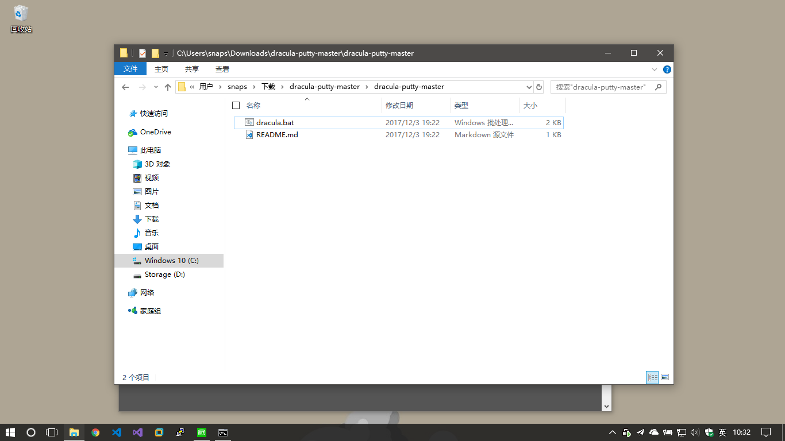
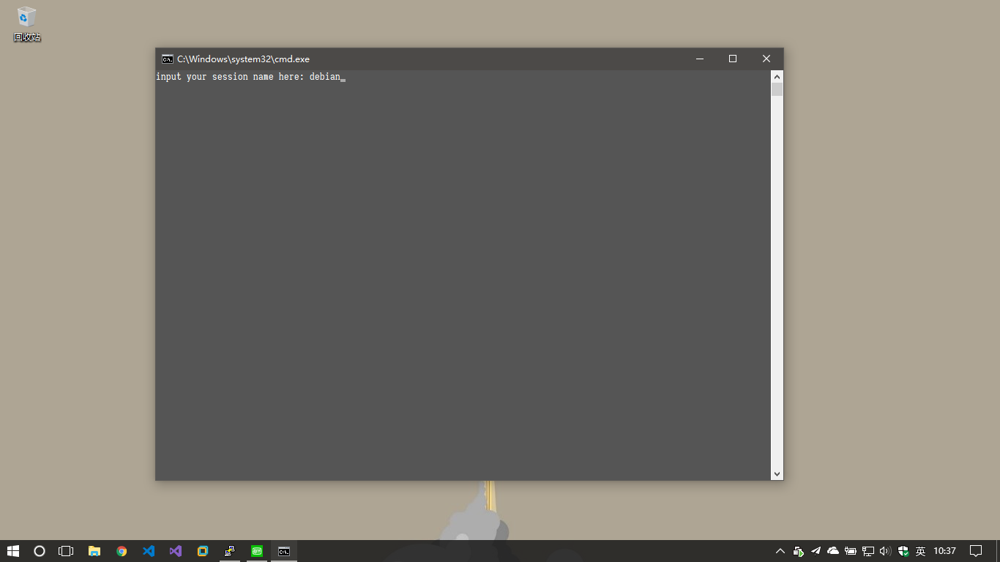
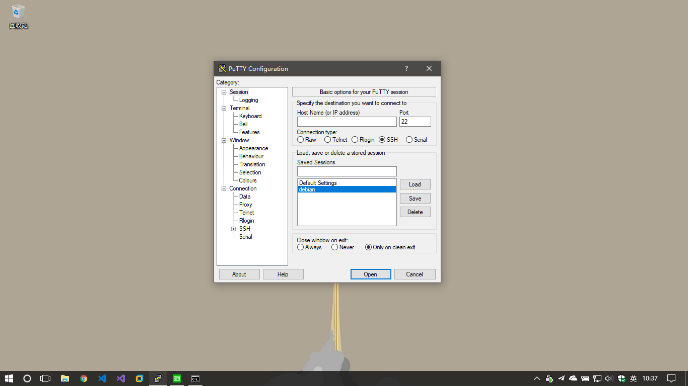
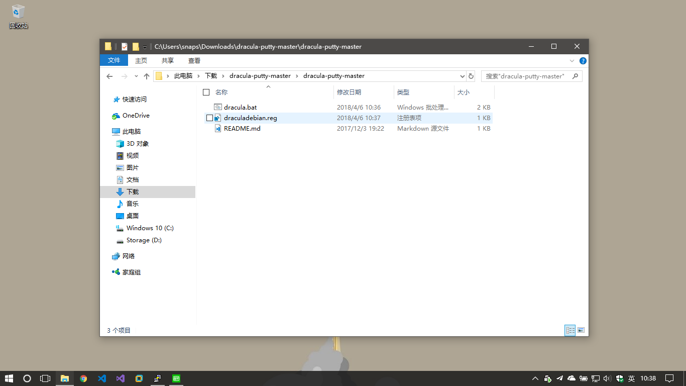
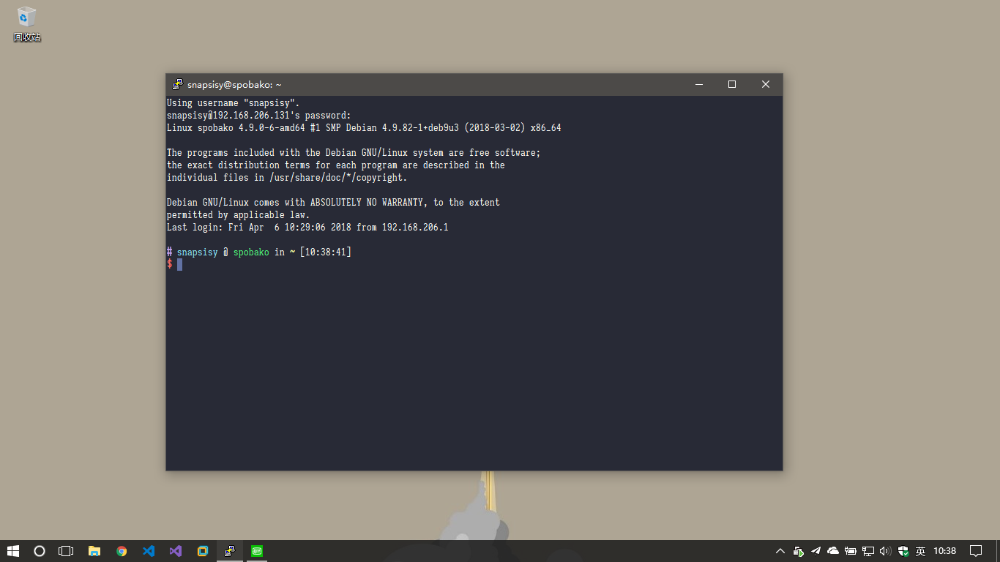

Use this tool is just as simple as invoking the batch file, input the session name

of your putty session, then there will a register file in your current directory,

which is named dracula{{session name}}.reg, double click on the register file will

do the work for you.

And you can see it happen from below.

0. Run dracula.bat

1. Input session name

2. If you don't know the session name, look up to it in putty

3. The register file has been generated, double click on it

4. After that, we are done
